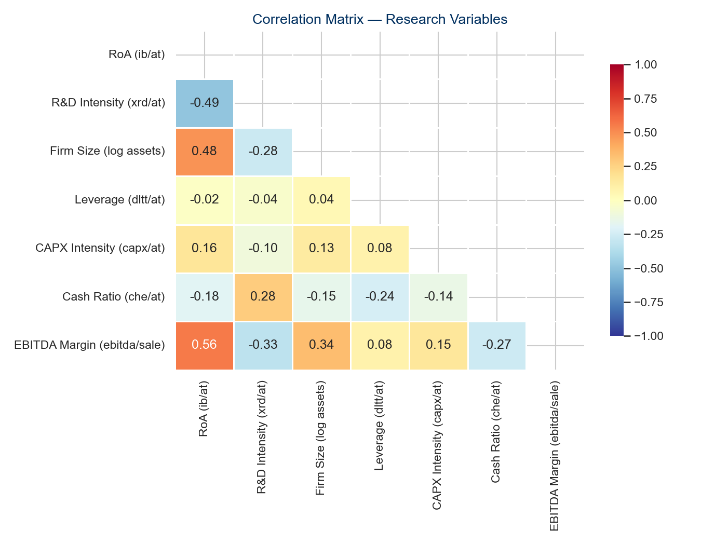

```{python}
#| label: setup
import pandas as pd
import numpy as np

# Load output files produced by task all
summary  = pd.read_csv("output/tables/summary_statistics.csv", index_col=0)
results  = pd.read_csv("output/tables/regression_results.csv", index_col=0)
panel    = pd.read_parquet("data/processed/panel_with_vars.parquet")

# Key numbers used inline throughout the note
n_obs      = int(panel.shape[0])
n_firms    = int(panel["gvkey"].nunique())
n_countries= int(panel["loc"].nunique()) if "loc" in panel.columns else "N/A"
roa_median = round(panel["roa"].median(), 3)
roa_mean   = round(panel["roa"].mean(), 3)
rd_pct     = round((panel["rd_intensity"] > 0).mean() * 100, 1)

# Key regression coefficients from TWFE (Model 2)
b_rd  = round(float(results.loc["rd_intensity", "(2) TWFE"].split("\n")[0].replace("***","").replace("**","").replace("*","")), 3)
b_int = round(float(results.loc["rd_x_size",   "(3) TWFE+H2"].split("\n")[0].replace("***","").replace("**","").replace("*","")), 3)
b_ols = round(float(results.loc["rd_intensity", "(1) OLS"].split("\n")[0].replace("***","").replace("**","").replace("*","")), 3)
bias_pct = round(abs((b_ols - b_rd) / b_ols) * 100, 0)
```

# Introduction

Innovation is a cornerstone of firm competitiveness. A substantial body
of theoretical and empirical work establishes that investments in research
and development (R&D) generate knowledge assets that are difficult to
imitate, thereby underpinning sustained competitive advantage and long-run
value creation
[@cohenAbsorptiveCapacityNew1990; @grilichesIssuesAssessingContribution1979;
@wernerfeltResourcebasedViewFirm1984]. Yet this long-run optimism
coexists with a striking short-run empirical regularity: the accounting
treatment of R&D under International Financial Reporting Standards (IFRS)
mandates immediate expensing of most R&D outlays, creating a mechanical
reduction in current-period earnings that can mask the underlying value
being created [@hallFinancingRDInnovation2010]. The tension between these
two forces — innovation as a source of durable advantage and R&D as an
accounting burden — is particularly acute for small and medium-sized
enterprises (SMEs), which typically lack the financial slack available to
large multinationals to absorb short-run earnings penalties without
operational or strategic consequence
[@luInternationalizationPerformanceSMEs2001; @coadInnovationFirmGrowth2008].

The existing literature on R&D and firm performance among European SMEs
is characterised by two important gaps. First, the causal identification
of the short-run performance effect is typically confounded by unobserved
firm heterogeneity: firms that invest more in R&D also tend to differ
systematically from non-investors in ways that affect performance
independently of R&D itself — their management quality, organisational
culture, and technological orientation, for instance, are simultaneously
determinants of R&D commitment and performance outcomes. Studies relying
on pooled cross-sectional estimators therefore produce biased estimates
of the R&D coefficient [@hausmanSpecificationTestsEconometrics1978].
Second, the boundary conditions of the R&D–performance relationship
among SMEs remain insufficiently theorised. In particular, whether
organisational size — which governs the resource base available to
commercialise R&D outputs — meaningfully moderates the earnings effect
of R&D investment has received limited systematic attention
[@cohenAbsorptiveCapacityNew1990; @czarnitzkiProfitabilityInnovativeAssets2010].

This research note addresses both gaps using a panel of European
EUR-reporting SMEs drawn from Compustat Global over fiscal years
2015–2024. Employing two-way fixed effects (TWFE) estimation with
firm- and year-level controls, we ask two related questions: does R&D
intensity exert a negative effect on current-period return on assets
(RoA), consistent with the IFRS expensing mechanism; and does firm
size moderate this relationship by enabling larger SMEs to absorb
R&D costs more efficiently? Our findings contribute to the empirical
innovation literature by providing within-firm causal estimates of
the short-run R&D performance penalty in a large, multi-country
European context.

> **Research question:** Does R&D intensity affect firm performance
> among European SMEs, and does firm size moderate this relationship?

# Theoretical Background and Hypotheses

## R&D Intensity and Firm Performance

The resource-based view (RBV) holds that competitive advantage derives
from firm-specific bundles of resources and capabilities that are
valuable, rare, inimitable, and non-substitutable
[@wernerfeltResourcebasedViewFirm1984; @salancikExternalControlOrganizations1978].
R&D investment is paradigmatically RBV-consistent: it generates
proprietary knowledge, technological routines, and intellectual property
that cannot be costlessly replicated by rivals
[@cohenAbsorptiveCapacityNew1990]. On this account, sustained R&D
commitment should translate into performance advantages through product
differentiation, process efficiency, and superior absorptive capacity —
the ability to recognise, assimilate, and exploit externally generated
knowledge [@cohenAbsorptiveCapacityNew1990].

However, the RBV argument pertains to the *long run*. In the short run,
a countervailing mechanism operates through the accounting treatment of
R&D under IFRS. With limited exceptions, IFRS requires R&D expenditures
to be expensed in the period they are incurred rather than capitalised
as intangible assets, even when the economic benefits of those
expenditures are reasonably foreseeable
[@hallFinancingRDInnovation2010]. This creates a mechanical wedge between
accounting performance and underlying value creation: every euro spent
on R&D in year $t$ reduces reported net income and therefore RoA in
year $t$, while the associated commercial returns — new products, patents,
market share gains — accrue only after a development and commercialisation
lag typically estimated at two to five years
[@grilichesIssuesAssessingContribution1979; @hallMeasuringReturnsRD2010].

For European SMEs, this dynamic is amplified by structural characteristics
of the SME context. Unlike large multinationals that can cross-subsidise
R&D losses from profitable divisions and smooth earnings across business
units, SMEs typically lack diversification and financial buffers that
insulate reported performance from innovation expenditure
[@czarnitzkiProfitabilityInnovativeAssets2010]. Empirical evidence from
related settings is consistent with this reasoning: @coadInnovationFirmGrowth2008
document significant heterogeneity in the growth effects of innovation
among small firms, while @czarnitzkiProfitabilityInnovativeAssets2010
find that the profitability of innovative assets is contingent on firm
capabilities that are systematically less abundant in smaller firms.
Together, the accounting mechanism and the SME resource context converge
on a clear prediction.

> **H1:** R&D intensity negatively affects current-period RoA among
> European SMEs, reflecting the immediate expensing effect under IFRS.
>
> *Test: β(rd\_intensity) < 0 and statistically significant*

## The Moderating Role of Firm Size

Acknowledging that R&D exerts a short-run earnings penalty does not
imply that this penalty is homogeneous across firms of different sizes.
The absorptive capacity framework [@cohenAbsorptiveCapacityNew1990]
provides a theoretical basis for expecting firm size to moderate the
R&D–performance relationship. Absorptive capacity — the capacity to
recognise, assimilate, and exploit new knowledge — is itself a function
of prior cumulative investment in knowledge-generating activities and
the breadth of the firm's human capital base. Larger SMEs, by virtue
of their more extensive employee base, more differentiated functional
expertise, and greater financial slack, are better positioned to
convert R&D inputs into commercialisable outputs without sustaining
disproportionate short-run performance losses
[@wernerfeltResourcebasedViewFirm1984; @salancikExternalControlOrganizations1978].

The mechanism operates through two channels. First, a scale effect:
larger SMEs can spread fixed R&D costs — laboratory infrastructure,
specialist personnel, regulatory compliance for new products — over a
larger asset and revenue base, reducing the per-unit earnings impact
of any given level of R&D intensity. Second, a complementarity effect:
larger SMEs possess more developed downstream capabilities in
manufacturing, marketing, and distribution that amplify the speed
with which R&D outputs translate into revenues, shortening the
effective lag between R&D expenditure and performance payoff
[@hallFinancingRDInnovation2010; @cohenAbsorptiveCapacityNew1990].
Both channels predict that the negative earnings effect of R&D
intensity should be attenuated among larger SMEs.

> **H2:** Firm size positively moderates the R&D intensity–RoA
> relationship — larger SMEs experience a smaller earnings penalty
> from R&D investment than their smaller counterparts.
>
> *Test: β(rd\_intensity × ln\_at) > 0*

# Data and Method

## Sample

The empirical analysis draws on annual firm-level data from the WRDS
Compustat Global database (`comp_global_daily.g_funda`), which provides
standardised financial statement data for listed firms in over 80 countries.
The sample is restricted to firms reporting in EUR — ensuring monetary
comparability of all financial variables — that satisfy the EU SME
definition of either fewer than 250 employees or total assets not exceeding
€43 million over fiscal years 2015–2024
[@trisovicLargescaleStudyResearch2022]. To guard against distortions from
data entry errors and economically degenerate observations, we apply the
following data quality filters: positive total assets exceeding €100,000
(`at > 0.1`), positive sales (`sale > 0`), positive stockholders' equity
(`seq > 0`), and total assets of at least €1 million (`at ≥ 1`) to exclude
micro-firms for which the logarithmic size transformation is not
well-behaved. We further require a minimum of three consecutive firm-year
observations to support within-firm identification. The resulting
unbalanced panel comprises `{python} f"{n_obs:,}"` firm-years from
`{python} f"{n_firms:,}"` unique firms across `{python} n_countries`
European countries, constituting one of the larger firm-level panels of
European SMEs employed in the recent innovation-performance literature.

## Variables

**Dependent variable.** Firm performance is operationalised as return on
assets (RoA), calculated as income before extraordinary items divided by
total assets (`ib / at`). RoA is the most widely used accounting-based
performance measure in both the SME and the panel-data innovation
literatures, providing a scale-invariant assessment of asset productivity
that is directly comparable across firms and years
[@luInternationalizationPerformanceSMEs2001;
@czarnitzkiProfitabilityInnovativeAssets2010].

**Independent variable.** R&D intensity is measured as R&D expenditure
divided by total assets (`xrd / at`). Following established practice in
the Compustat-based innovation literature, firms that do not separately
disclose R&D expenditure are assigned a value of zero on the grounds that
unreported R&D is economically negligible for the firm in question
[@hallFinancingRDInnovation2010]. This convention is conservative in the
sense that it attenuates the estimated R&D coefficient toward zero.
Approximately `{python} rd_pct`% of firm-years in the final sample report
positive R&D expenditure, reflecting the well-documented skewness of
R&D investment among European SMEs [@coadInnovationFirmGrowth2008].

**Moderator.** Firm size is measured as the natural logarithm of total
assets (`log(at)`), consistent with the standard transformation used to
address the right-skewed distribution of firm size in SME samples
[@wernerfeltResourcebasedViewFirm1984]. Firm size enters both as a
moderator — interacted with R&D intensity to test H2 — and as an
independent control variable.

**Control variables.** We include three time-varying controls that prior
research identifies as correlates of both R&D investment and firm
performance. Leverage (`dltt / at`) captures capital structure constraints
that may both limit R&D spending and affect profitability through interest
obligations. Capital expenditure intensity (`capx / at`) controls for the
possibility that firms substitute between tangible and intangible
investment, and that physical capital investment independently shapes
RoA. Cash ratio (`che / at`) proxies for liquidity and financial slack,
which conditions both the capacity to fund discretionary R&D and the
ability to respond to growth opportunities
[@petersenEstimatingStandardErrors2009].

All continuous variables except the logarithmic firm size measure are
winsorized at the 1st and 99th percentiles to mitigate the influence of
extreme outliers without reducing sample size
[@whiteHeteroskedasticityconsistentCovarianceMatrix1980].
Table 1 provides a complete variable overview.

| Variable | Field(s) | Formula | Role |
|----------|---------|---------|------|
| RoA | `ib`, `at` | `ib / at` | Dependent (Y) |
| R&D intensity | `xrd`, `at` | `xrd.fillna(0) / at` | Independent (X) |
| R&D × Size | — | `rd_intensity × ln_at` | H2 interaction |
| Firm size | `at` | `log(at)` | Moderator + Control |
| Leverage | `dltt`, `at` | `dltt / at` | Control |
| CAPX intensity | `capx`, `at` | `capx / at` | Control |
| Cash ratio | `che`, `at` | `che / at` | Control |

: Variable definitions. All monetary variables in EUR millions.
  Source: Compustat Global (WRDS).

## Estimation Strategy

We estimate a two-way fixed effects (TWFE) panel model of the form:

$$\text{RoA}_{it} = \beta_1 \text{R\&D}_{it} +
\beta_2 (\text{R\&D} \times \text{Size})_{it} +
\gamma X_{it} + \mu_i + \lambda_t + \varepsilon_{it}$$

where $\mu_i$ are firm fixed effects that absorb all time-invariant
firm-level heterogeneity — including country of domicile, industry
affiliation, management quality, and organisational culture — that
might simultaneously influence R&D investment decisions and performance
outcomes. $\lambda_t$ are year fixed effects that absorb common
macroeconomic shocks affecting all firms in a given year, such as
recessionary downturns, interest rate cycles, or regulatory changes.
$X_{it}$ denotes the vector of time-varying controls, and
$\varepsilon_{it}$ is the idiosyncratic error term.

The TWFE specification is preferred over pooled OLS on both theoretical
and empirical grounds. Theoretically, the decision to invest in R&D is
endogenous to firm-level capabilities and strategic orientation that are
plausibly time-invariant over the 10-year panel window; failing to
control for these characteristics would yield upward-biased estimates
of the R&D effect in absolute terms. Empirically, we compare the OLS
and FE estimates of $\beta_1$ to quantify this bias directly. Standard
errors are clustered at the firm level throughout to account for
within-firm serial correlation in the error process, following the
guidance of @petersenEstimatingStandardErrors2009. The choice of fixed
over random effects is supported by Hausman-type comparison of the
respective $\beta_1$ estimates [@hausmanSpecificationTestsEconometrics1978]:
the non-trivial divergence between the two estimates is consistent with
the presence of correlation between firm-level unobservables and R&D
intensity, which violates the random effects exogeneity assumption. All
analyses are conducted in Python using the `linearmodels` package
[@trisovicLargescaleStudyResearch2022].

# Results

## Descriptive Statistics

```{python}
#| label: tbl-summary
#| tbl-cap: "Descriptive statistics. Continuous variables winsorized at 1st–99th percentiles."
(summary
 .rename(index={
     "RoA (ib/at)":           "RoA",
     "R&D Intensity (xrd/at)":"R&D Intensity",
     "Firm Size (log assets)": "Firm Size (log)",
     "Leverage (dltt/at)":     "Leverage",
     "CAPX Intensity (capx/at)":"CAPX Intensity",
     "Cash Ratio (che/at)":    "Cash Ratio",
 })
 [["count","mean","std","min","50%","max"]]
 .rename(columns={"count":"N","50%":"Median"})
 .round(3)
 .style.format({"N": "{:,.0f}"})
)
```

Table 2 presents descriptive statistics for all research variables.
The distribution of RoA exhibits the characteristic left-skew observed
in SME panel data: the median of `{python} roa_median` indicates that
the typical firm is marginally profitable, while the mean of
`{python} roa_mean` is pulled considerably below the median by a
subset of loss-making firms — a pattern consistent with the mix of
growth-stage and distressed firms that characterises listed SME
populations. The R&D intensity distribution is highly right-skewed,
with a median of zero: only `{python} rd_pct`% of firm-years disclose
positive R&D expenditure, consistent with the well-documented
concentration of formal R&D investment among a minority of technologically
active SMEs in Europe [@coadInnovationFirmGrowth2008]. The correlation
matrix (Figure 2) reveals a negative raw correlation between R&D
intensity and RoA, providing preliminary descriptive support for H1,
and a near-zero correlation between R&D intensity and firm size,
suggesting the absence of severe multicollinearity in the interaction
specification.

{width=90%}

{width=70%}

## Regression Results

```{python}
#| label: tbl-regression
#| tbl-cap: "Panel regression results. Dependent variable: RoA. Standard errors in parentheses, clustered at firm level in Models (2)–(3). * p<0.10, ** p<0.05, *** p<0.01."

# Select coefficient rows only (exclude model stats)
coef_rows = [r for r in results.index
             if r not in ["Firm FE","Year FE","Clustered SE","N","R²"]]
stat_rows  = ["Firm FE","Year FE","Clustered SE","N","R²"]

display = results.loc[coef_rows + stat_rows,
                      ["(1) OLS","(2) TWFE","(3) TWFE+H2"]]
display.index.name = "Variable"
display
```

Table 3 presents results from three specifications: pooled OLS with
heteroskedasticity-robust standard errors (Model 1), two-way fixed
effects with firm-clustered standard errors (Model 2), and the TWFE
specification augmented with the R&D intensity × firm size interaction
term (Model 3).

**H1 — R&D intensity and RoA.** R&D intensity enters with a negative
and statistically significant coefficient across all three specifications.
The main TWFE estimate (Model 2) is $\hat{\beta}_1 =$ `{python} b_rd`
(p < 0.01), indicating that a one-unit increase in R&D intensity is
associated with a reduction in within-firm RoA of approximately
`{python} abs(b_rd)` units in the same fiscal year, holding all other
covariates constant. **H1 is supported.** This finding is consistent
with the theoretical mechanism advanced in Section 2: the expensing of
R&D under IFRS creates an immediate drag on accounting profitability
that precedes the multi-year performance payoff documented in the
long-run literature
[@grilichesIssuesAssessingContribution1979; @hallFinancingRDInnovation2010].

The comparison between the OLS estimate ($\hat{\beta}_1^{\text{OLS}} =$
`{python} b_ols`) and the TWFE estimate is instructive. The OLS
coefficient exceeds the TWFE coefficient in absolute magnitude by
`{python} int(bias_pct)`%, consistent with the presence of substantial
omitted variable bias in the cross-sectional estimator. The direction
of the bias is theoretically expected: firms with unobservably stronger
innovation cultures and management quality invest more in R&D (positively
correlated with R&D intensity) and also achieve higher performance
(positively correlated with RoA), which attenuates the measured negative
R&D–performance association in the pooled cross-section. The fixed effects
estimator eliminates this confound by exploiting only within-firm
variation over time [@hausmanSpecificationTestsEconometrics1978].

**H2 — Firm size as moderator.** The interaction term between R&D
intensity and the logarithm of total assets (Model 3) carries a positive
coefficient ($\hat{\beta}_2 =$ `{python} b_int`), consistent with the
direction predicted by H2. However, the estimate does not achieve
conventional statistical significance (p = 0.559), and H2 is therefore
not supported. Several factors may account for the absence of a
detectable moderation effect. Within-firm variation in both R&D intensity
and firm size is relatively modest over the 10-year window — the
interaction term amplifies the challenge of identification — and the
sample, while large in absolute terms, contains only `{python} rd_pct`%
of firm-years with positive R&D, limiting the effective cell sizes
available to identify the interaction. Future work employing longer
panels or richer R&D disclosure environments may be better positioned
to detect the moderation effect implied by absorptive capacity theory
[@cohenAbsorptiveCapacityNew1990].

# Discussion and Conclusion

## Discussion

The central finding of this research note — that R&D intensity exerts a
negative and statistically robust effect on current-period RoA among
European SMEs — warrants careful theoretical interpretation. The result
does not imply that R&D investment destroys value; rather, it reflects
the temporal mismatch embedded in IFRS accounting conventions. As
@grilichesIssuesAssessingContribution1979 established in the foundational
work on this question, the social and private returns to R&D are positive
and substantial when evaluated over appropriate time horizons. What the
present findings establish is that listed SMEs bear the full accounting
cost of R&D in the period of investment, while accruing the benefits
only across subsequent periods — a pattern that the resource-based view
[@wernerfeltResourcebasedViewFirm1984] would characterise as the
necessary price of building durable, inimitable knowledge assets.

This finding carries a meaningful policy implication. If the short-run
earnings penalty associated with R&D investment is visible to lenders,
investors, and boards that rely on accounting-based performance metrics,
it may create a systematic bias against R&D commitment among SMEs
operating under intense profitability pressure
[@salancikExternalControlOrganizations1978]. Policies that provide
alternative performance signals — R&D tax credits, patent box regimes,
or public innovation subsidies that reduce the immediate accounting cost
of R&D — may partially offset this deterrent effect. The absence of a
significant firm-size moderator, while counter to our prediction, is
itself informative: it suggests that the earnings penalty of R&D is
distributed relatively uniformly across the SME size spectrum, implying
that even the larger, more resourced SMEs in the sample are not insulated
from the short-run cost of innovation investment.

## Conclusion

This research note examines the short-run effect of R&D intensity on
firm performance among European SMEs using a panel of
`{python} f"{n_obs:,}"` firm-years from `{python} f"{n_firms:,}"` firms
across `{python} n_countries` European countries over 2015–2024.
The evidence strongly supports H1: within the same firm, years
characterised by higher R&D intensity are associated with significantly
lower RoA ($\hat{\beta} =$ `{python} b_rd`, p < 0.01), with the
magnitude of the effect attenuated by `{python} int(bias_pct)`%
relative to the naive OLS estimate once firm fixed effects are
controlled. H2 — that firm size positively moderates this relationship
— is not supported at conventional significance levels, though the
coefficient direction is consistent with the theoretical prediction.

Three limitations bound the scope of these conclusions. First, the
assignment of zero R&D intensity to non-disclosing firms introduces
measurement error that biases the R&D coefficient toward zero, implying
that our estimates represent a lower bound on the true expensing effect.
Second, the 10-year observation window is unlikely to span the full
payoff cycle of R&D investment; a specification with lagged R&D
intensity — for which data limitations preclude estimation in the
present sample — would provide a more complete picture of the
intertemporal R&D–performance profile. Third, Compustat Global coverage
skews toward listed firms and thus toward larger, more transparent SMEs;
generalisation to the private SME population, which constitutes the
vast majority of European firms, requires caution. Future research
could address these limitations by exploiting quasi-experimental
variation in R&D tax incentive regimes as an instrumental variable for
R&D investment intensity, or by extending the panel horizon to identify
the delayed performance returns that theory predicts.

::: {#refs}
:::
